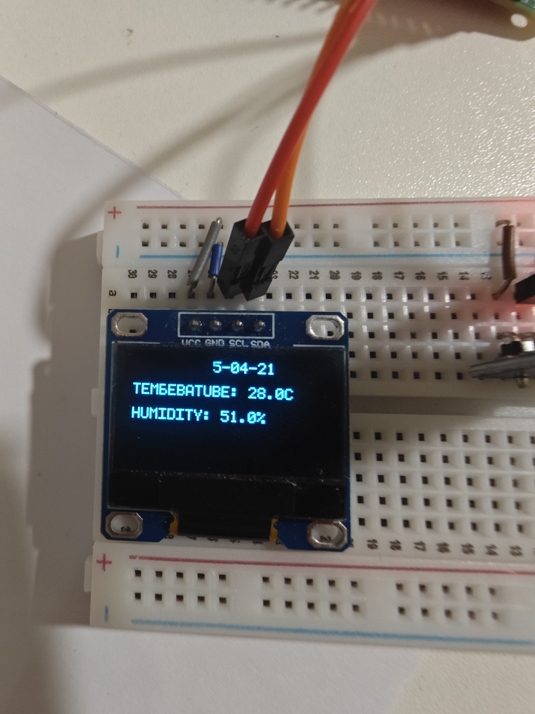
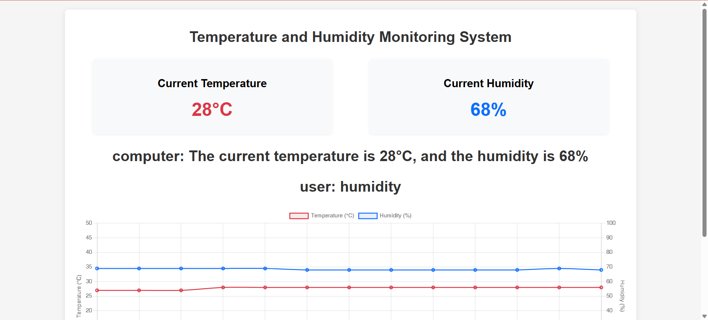
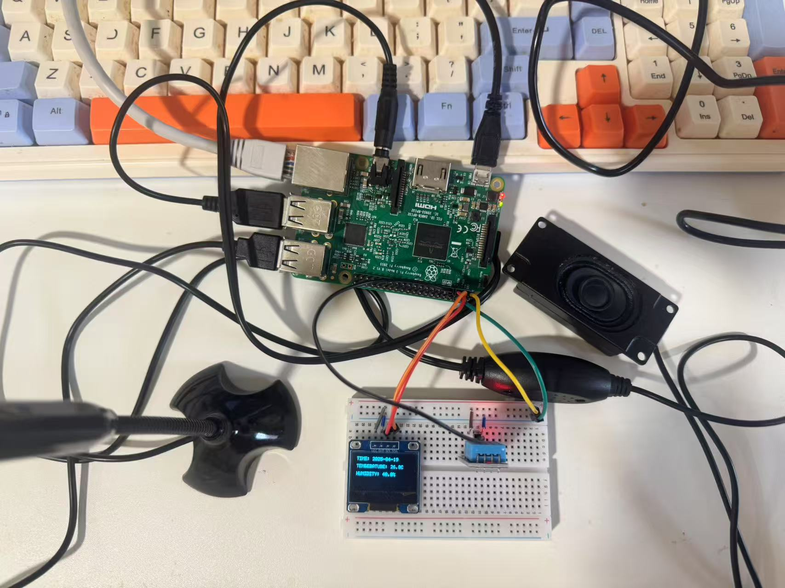
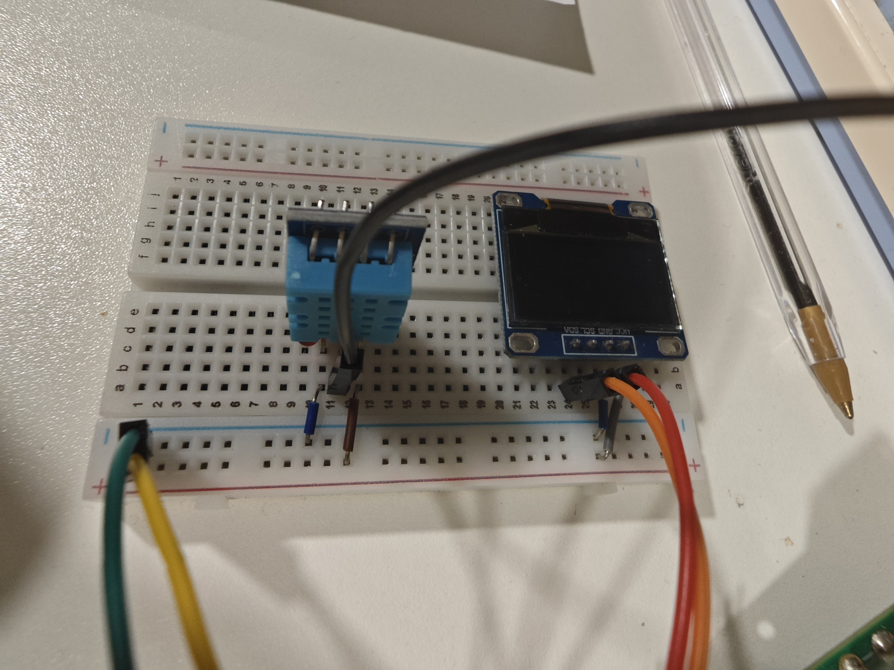
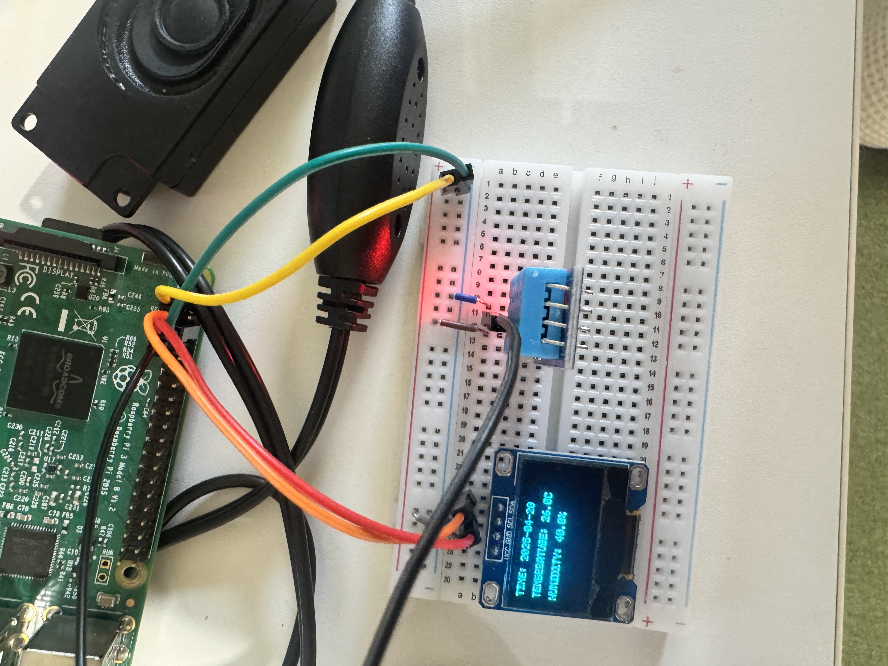

# Real-Time Environmental Monitoring System for Raspberry Pi

**Revolutionize your environmental monitoring with our cutting - edge Raspberry Pi system!**

An embedded system developed for Raspberry Pi, integrating temperature/humidity monitoring, OLED data display, data storage, and voice interaction. Suitable for smart homes, greenhouses, and small-scale industrial monitoring. Uses C++ for hardware drivers and Python for web services and voice functions, balancing performance and development efficiency.

### Project Promotion
We have also uploaded a demonstration video of this project on YouTube, which shows the real - time operation of the environmental monitoring system, including data display on the OLED screen, voice interaction functions, and the web interface for data visualization. You can watch the video by clicking [here](https://youtu.be/6Cy_jflKvcY?si=Tw9HrwRCOWop9JV1).


## 1. Project Overview
### Project Name
Real-Time Environmental Monitoring System for Raspberry Pi

### Project Description
An embedded system developed for Raspberry Pi, integrating temperature/humidity monitoring, OLED data display, data storage, and voice interaction. Suitable for smart homes, greenhouses, and small - scale industrial monitoring. Uses C++ for hardware drivers and Python for web services and voice functions, balancing performance and development efficiency.

### Core Advantages
- **Realtime Performance**: Thread prioritization and multi - threading ensure non - blocking sensor data collection and interface refresh.
- **Modular Design**: Separation of hardware drivers (DHT11, OLED) and software services (Web, Voice) for easy expansion and maintenance.
- **User Interaction**: Supports voice queries and anomaly alerts, reducing operational complexity.

## 2. Key Functional Features  

### 1. Real-Time Temperature/Humidity Monitoring  
- **Hardware Support**: DHT11 sensor (connected to GPIO4), with data validation and outlier filtering.  
- **Data Collection**:  
  - Real-time sampling at 1-second intervals, implemented via `readData()` in `dht11.cpp` for sensor communication and checksum verification.  
  - Returns `std::nullopt` on validation failure to avoid invalid data entry.  
- **Threshold Alerts**:  
  - Temperature: 10°C ~ 40°C, Humidity: 20% ~ 95%.  
  - Voice warnings ("Current temperature is too high, please ventilate!") and OLED flashing for out-of-range values.  

### 2. OLED Visualization  
- **Hardware Connection**: 128x32 I2C OLED display (GPIO2/SDA, GPIO3/SCL).  
- **Display Content**:  
  - **Time**: Real-time date (YYYY-MM-DD) on page 0.  
  - **Temperature**: 0.1°C precision, format: "TEMPERATURE: X.X°C" (page 2).  
  - **Humidity**: 0.1% precision, format: "HUMIDITY: X.X%" (page 4).  
- **Refresh Mechanism**: Auto-clears and redraws data every 60 seconds for clarity.



### 3. Data Storage & Web API  
- **Local Storage**:  
  - Data stored in `sensor_data.json` (JSON format), retaining up to 1000 historical records.  
  - Includes timestamp, temperature, and humidity fields, supporting resume on breakpoint and file recovery.  
- **Web Services**:  
  - Flask-based RESTful API:  
    - **POST /data**: Upload real-time data (Content-Type: application/json).  
    - **GET /data**: Retrieve historical data for frontend display or analysis.



### 4. Voice Interaction System  
- **Speech Recognition**:  
  - The system is activated by the wake - word "computer" and supports both English and Chinese voice commands.
  - It can accurately recognize queries such as "What's the humidity?" or "Exit system". During tests on the Raspberry Pi 3B, the response time was under 1.5 seconds, ensuring a quick and efficient interaction experience.
- **Speech Synthesis**:  
  - Leveraging the `webkitSpeechRecognition` and `SpeechSynthesisUtterance` web APIs for voice feedback, offering a smooth and browser - compatible solution.
  - The speech rate can be adjusted according to user preferences, with a default setting of 150 words per minute. The volume can also be easily tweaked.
  - In case of environmental anomalies, the system will automatically broadcast warnings. For example, if the humidity drops below 20%, it will announce "Warning: Humidity below 20%, please increase humidity!"


## 3. Technical Architecture & Implementation  

### 1. Hardware Architecture  
| Component       | Model/Specification | Function               | Connection       |  
|-----------------|---------------------|------------------------|------------------|  
| Main Board      | Raspberry Pi 3B (4GB)| System control         | N/A              |  
| Sensor          | DHT11               | Temp/humidity collection| GPIO4 (BCM)      |  
| Display         | 128x32 OLED         | Data visualization     | I2C (GPIO2/SDA, GPIO3/SCL) |  



### 2. Software Architecture  
```  
Raspberry Pi OS (Raspbian)  
├─ C++ Hardware Driver Layer  
│  ├─ DHT11 Class (dht11.h/cpp): Sensor communication and data validation  
│  └─ OLED Class (oled.h/cpp): I2C protocol and text rendering  
├─ Python Service Layer  
│  ├─ Flask Web Server (server.py): Data storage and API  
│  └─ Web(index.html/web): Web and voice modules
└─ Main Program (main.cpp): Multi-thread integration of drivers and services  
```  

### 3. Key Technical Points  
- **Multi-Threading**:  
  - `std::async` in `main.cpp` starts Web server and voice assistant in the background, avoiding blocking the sensor collection loop.  
  - Highest thread priority for sensor reading (`set_max_priority`) to ensure realtime response.  
- **Memory-Mapped GPIO**:  
  - Direct GPIO register access via `mmap` in `dht11.cpp` for high-speed communication (requires root privileges).  
- **Cross-Language Collaboration**:  
  - C++ for high-performance hardware drivers, Python for I/O-bound tasks (network requests, speech synthesis), balancing efficiency and development speed.  

## 4. Quick Start & Usage Guide  

### 1. Hardware Wiring  
| DHT11 Pin | Raspberry Pi Physical Pin | BCM GPIO Number |  
|-----------|---------------------------|-----------------|  
| VCC       | 2/4 (5V)                  | -               |  
| DATA      | 7                         | GPIO4           |  
| GND       | 6                         | -               |  

The OLED display connects via I2C; enable I2C in `raspi-config` before use.




### 2. Software Installation  
#### Step 1: Clone Repository  
```bash  
git clone https://github.com/fantasywinter207/Temperature-and-humidity-Pi-3B.git  
cd Temperature-and-humidity-Pi-3B 
```  

### 3. System Startup Commands  
```bash
bash ./run.sh
```

### 4. Voice Command List
| Command Type   | Example Command         | System Response                     |
|----------------|-------------------------|-------------------------------------|
| Wake Command   | "computer"              | "How can I help you?"               |
| Temp/Humid Query| "Humidity" or "temperature"| "Current temperature is 25.5°C"     |
| Time Query     | "time"      | "The current time is 14:30"         |
| Exit Command   | "exit" or "quit"                 | "Goodbye!" (stops all services)     |

## 5. Code Structure & Module Description
### 1. Directory Structure
```
Project Root
├── dht11.h         # DHT11 Class Declaration
├── dht11.cpp       # DHT11 Driver Implementation
├── oled.h          # OLED Class Declaration
├── oled.cpp        # OLED Driver Implementation
├── main.cpp        # Main Program Logic
├── server.py       # Web Server
├── sensor_data.json    # Data Storage File
├── requirements.txt    # Python Dependencies
├── templates/      # HTML templates
│   └── index.html  # Front - end page
├── run.sh          # Script to compile and run the program
├── .github/        # GitHub Actions configuration
│   └── workflows/
│       └── c - cpp.yml # C/C++ CI configuration
└── LICENSE         # License File
```

### 2. Core Class Descriptions
#### DHT11 Class (dht11.h/cpp)
- **Function**: Encapsulates DHT11 communication and data validation.
- **Key Methods**:
  - `readData()`: Returns `std::pair<float, float>` (humidity, temperature), or `std::nullopt` on validation failure.
  - `pi_mmio_init()`: Initializes GPIO memory mapping for high-speed hardware access.

#### OLED Class (oled.h/cpp)
- **Function**: Controls OLED display, supporting text rendering and initialization.
- **Key Methods**:
  - `drawText(int page, int col, std::string)`: Draws text at specified page (0 - 4) and column (0 - 127).
  - `init()`: Configures OLED parameters (contrast, scan direction, etc.).

## 6. Contribution & Collaboration
### 1. Code Standards
- **C++**: Follow C++11, camelCase naming (e.g., `drawText`), Doxygen comments for key functions.
- **Python**: Adhere to PEP8, module-level comments, avoid global variables.
- **JavaScript**: Adhere to common JavaScript style guides, use meaningful variable and function names, and add comments to explain complex logic, especially in the voice - related code using `webkitSpeechRecognition` and `SpeechSynthesisUtterance`.  

### 2. Contribution Workflow
1. Fork the repo and create a feature branch (e.g., `feature/add-bme280`).
2. Run unit tests (to be added) before code submission.
3. Submit Pull Requests with feature descriptions and test steps.

### 3. Issue Reporting
- **Bug Reports**: Include reproduction steps, hardware model, and error logs (e.g., "dht11.cpp line XX validation failed").
- **Feature Requests**: Submit via GitHub Issues with "Enhancement" label. 


### 7. Team Division of Labor

| Team Member | Student ID | Responsibilities |
| --- | --- | --- |
| Yuhang Nan | 2962263N | - `dht11.cpp` and `dht11.h`: Implement the data acquisition function of the DHT11 temperature and humidity sensor, including writing the code for sensor initialization, data reading, and verification logic to ensure accurate and stable data acquisition. <br> - `main.cpp`: Integrate the functions of each module, build the overall operation framework of the project, coordinate the interaction between hardware drivers and software functions, and handle program flow control and exception situations. |
| Yuan Zhuang | 2951084Z | - `oled.cpp` and `oled.h`: Write the driver code for the OLED display screen, implement functions such as screen initialization and content drawing (e.g., temperature and humidity data, system status), and optimize the display effect and refresh speed. |
| Jianxiang Fan | 2962248F | - `server.py`: Build a web server, handle HTTP requests and responses, provide data interfaces for the front - end page, and ensure the stability and security of data transmission. <br> - Voice - related JavaScript scripts: Implement voice recognition and synthesis functions based on `webkitSpeechRecognition` and `SpeechSynthesisUtterance`, including wake - word detection, voice command parsing, and voice feedback generation logic development. |
| Chu Ci Wang | 2932412W | - `sensor_data.json`: Design the data storage structure, implement the persistent storage and reading operations of sensor data (such as temperature and humidity), and ensure the reliability and efficiency of data storage. <br> - `readme`: Write the project README document, accurately describe the project's functions, architecture, usage methods, division of labor, etc., to facilitate others to understand and use the project. `program` an executable file, is the main entry point of the compiled program.
| Lianzheng Xin | 2962333X | - write the `run.sh` script to implement functions such as quick project startup, environment configuration check, and dependency installation, improving the convenience of project deployment and operation. | 
## 8. License & Acknowledgments
### License
This project is licensed under the **MIT License** — see the [LICENSE](LICENSE) file for details.

### Acknowledgments
Thanks to the following open-source projects and communities:
- [Flask](https://palletsprojects.com/p/flask/): Web development framework
- [Raspberry Pi Foundation](https://www.raspberrypi.org/): Hardware documentation and community resources

## 9. Future Plans
### Maintenance
- Regular dependency updates and security patches (monthly).
- Bug fixes for community feedback within 72 hours.

### Roadmap
| Version | Timeline | Core Features                          |
|---------|----------|----------------------------------------|
| v1.1    | Q1 2025  | Support for BME280 sensor (pressure/altitude) |
| v1.2    | Q2 2025  | Migrate from JSON to SQLite database    |
| v1.3    | Q3 2025  | Develop mobile apps (Android/iOS)      |
